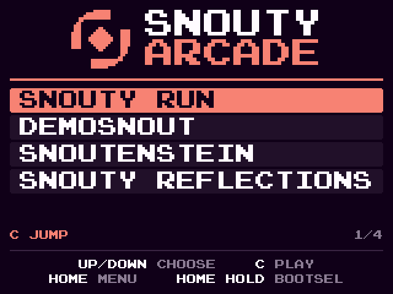

# Snouty Arcade (M2)

`zig-out/firmware/snouty-tufty-arcade.uf2` is one firmware that holds every
cart in build.zig's `carts` table, behind a boot menu. Flash it like any
other UF2 (see [DEPLOY.md](DEPLOY.md)). The per-cart `snouty-tufty-<cart>.uf2`
builds (`-Dcart=`) still exist and behave as in M1.



(`zig build menu-png` renders this from the firmware's own menu code,
`src/menu.zig`, at 2x. It is the panel's exact 320x240 picture, colours
quantised to RGB565.)

## Controls

| Where | Button | Does |
|---|---|---|
| menu | UP / DOWN | move the highlight. It wraps, and auto-repeats when held (400 ms, then every 150 ms) |
| menu | C or A | play the highlighted cart |
| in a cart | HOME, short press | stop the cart and return to the menu with that cart highlighted |
| anywhere | HOME, held 1 s | reboot into BOOTSEL (the `RP2350` drive) |

In a cart every other button belongs to the cart, through that cart's map
(docs/ports/). The menu line under the list shows the highlighted cart's
main controls, plus its position (`1/2`).

Details:
* The button that launched a cart (A or C) is hidden from the cart until it
  is released. So snouty-run does not jump on its first frame.
* Buttons that are still held when the menu comes back do nothing until they
  are released.
* The menu ignores everything while HOME is down.
* The last-launched cart is remembered in RAM. After HOME, the menu
  highlights it again. A power cycle starts at the top of the list (nothing
  is written to flash).

## How it works

Core 0 runs the Tufty OS. In the menu, core 1 is held in reset, and core 0
streams the menu to the panel one 240-pixel column at a time, through the
same two column buffers the cart present uses. There is no framebuffer. A
redraw takes one panel frame (~7.4 ms) and happens only when the highlight
moves.

A launch runs the M1 cart start, with the chosen cart's image, scale mode
and button map picked at run time from a table:

1. stop (below)
2. zero cart RAM 0x20020000..0x20080000
3. copy the image to 0x20035100 and zero its BSS
4. build the scaler maps for the cart's scale and black the panel
5. reset the button mapper with the cart's map
6. `launch_core1`

HOME stops the cart. That is safe at any moment of the cart's life, for these
reasons:

* core 0 handles HOME only between loop iterations, and a present is
  synchronous on core 0 (it ends with DMA channel 0 done, the PIO stalled
  and CS high), so a stop never cuts a panel transfer.
* PSM `FRCE_OFF.PROC1` holds core 1 in reset until the next launch.
* DMA channels 1..15 are aborted (CHAN_ABORT at the RP2350 offset 0x464),
  and the SIO spinlock that the cart's tracy code takes is freed.
* The FIFO from the cart is drained and its sticky flags are cleared. A
  queued present is dropped, so no FRAMEBUFFER_DONE goes to a stopped
  cart. Stale words in the other direction are absorbed by the
  `launch_core1` handshake (it restarts on any mismatched echo).

The logic that decides when things happen is pure and host-tested in
`src/arcade.zig`: screens, cursor, wrap, repeat, HOME short/long, the
launch mask and the bad-image rule. Its tests drive a model of core 1
through 20 launch / play / HOME rounds over three carts. They check that
every launch is preceded by a stop of the running cart, and that the menu
is only drawn with core 1 stopped. The drawing is host-tested in
`src/menu.zig`, and the UF2 check in `src/uf2_check.zig`.

The single-cart build uses the same code with a one-row table and
`arcade = false`: it boots straight into the cart, and HOME restarts it.

If a cart image fails validation (descriptor, version, BSS, entry), the
arcade dims that row and shows "BAD CART IMAGE", and it never launches. The
single-cart build shows the M1 solid-colour error screen.

## Adding a cart

Add one row to `carts` in build.zig and one map to src/controls_map.zig:

```zig
// build.zig
const carts = [_]Cart{
    ...
    .{ .name = "snouty-bugs", .binary = "snouty-bugs" },   // scale defaults to .fit
};

// src/controls_map.zig
pub const snouty_bugs: Map = .{ .bindings = &.{ ... } };
// ... and in for_cart():
    if (std.mem.eql(u8, name, "snouty-bugs")) return &snouty_bugs;
```

* `name` is the cart's directory under `snouty-badge/carts/`.
* `binary` is the ELF name its build installs.
* `scale` is `.fit`, `.crop` or `.native`.
* `title` is optional. It defaults to the name in capitals with dashes as
  spaces ("SNOUTY BUGS"). Titles up to 18 characters are drawn at 2x, and
  longer ones at 1x.
* The optional blurb (the controls line in the menu, up to 32 characters)
  goes in the `blurbs` table below `carts`, keyed by name.
* A cart without its own map gets `controls_map.default`.

The row order is the menu order. The cart is then in the arcade, and
`-Dcart=<name>` builds it alone. Check the flash report afterwards (next
section).

## Flash budget

| Range | Use |
|---|---|
| 0x10000000..0x101C0000 (1792 KB) | the firmware: Tufty OS, menu, and every cart image (the budget) |
| 0x101C0000..0x10200000 (256 KB) | the XIP cart window: empty, or the one XIP cart (below) |
| 0x10200000.. | the badge's ROMFS and FAT drive. Never touched |

### One XIP cart in the arcade

A row with `.xip = true` is an execute-in-place cart (the monorepo's
`-Dcart-mode=xip`, linked to 0x101C0000 by the SDK's `cart_xip.ld`). The OS
embeds no image for it: tools/uf2_pack.zig adds its image to the UF2 at
0x101C0000, and flash_check requires it there byte for byte, with every
other block still below 0x101C0000. At boot the OS checks the window's
vector table (SP in cart RAM, Thumb reset handler in the window, as the
SYCL OS's executeCart) and its CRC32 against the build's (`xip_meta`); a
bad window dims the row. A launch zeroes cart RAM and starts core 1 at the
reset handler with the vector table's SP and VTOR. HOME stops it like any
cart. At most one XIP row per firmware (one window); `.arcade = false`
keeps a row out of the arcade, and `.rom_drive` (snouty-genesis' FAT12
drive at 0x10080000, which overlaps the RAM carts) is single-cart only.
See [ports/snouty-genesis.md](ports/snouty-genesis.md).

The build enforces this. After each cart-host firmware build,
`tools/flash_check.zig` checks the UF2:

* every block is RP2350_ARM_S main flash inside 0x10000000..0x101C0000
* so there is no `0x10ffff00` absolute block
* every cart image is in the payload byte for byte

If a check fails, the build fails with an error that names the address,
for example:

```
error: flash budget: snouty-tufty-arcade.uf2 reaches 0x101C0100 (block ...), past the flash budget end 0x101C0000.
```

The linker's 2 MB flash region is a second, hard stop at 0x10200000.

The report is installed next to each UF2 as
`zig-out/firmware/<name>.flash.txt`. On 2026-10-02 the arcade
(snouty-run + demosnout) reported:

```
snouty-tufty-arcade.uf2
  1006 blocks, family 0xe48bff59 (RP2350_ARM_S), all main flash
  flash   0x10000000..0x1003EE00  257536 bytes (251.5 KB)
  budget  0x10000000..0x101C0000  1835008 bytes (1792 KB): 14.0% used, 1577472 bytes (1540.5 KB) free
  0x101C0000..0x10200000 (reserved for an XIP cart) and everything above: untouched
  cart images (byte-identical in the UF2 payload):
    snouty-run           0x10002646..0x10027C6A  153124 bytes (149.5 KB)
    demosnout            0x10027C6B..0x1003DC07  90012 bytes (87.9 KB)
  carts 243136 bytes (237.4 KB), OS + tables 14400 bytes (14.1 KB)
```

The OS, the menu and the tables cost about 14 KB, and each cart costs its
image size. The image size is its `.text` + `.data`. BSS costs no flash, so
demosnout's 174 KB `.bss` takes none.

The [port notes](ports/README.md) give the sizes of the other four carts
(`.text` + `.data`): snouty-bugs ~56 KB, snouty-maze ~70 KB,
snoutenstein ~98 KB, and snouty-reflections ~108 KB (tufty20). With all
six carts the arcade comes to 584 KB of the 1792 KB budget (32.6%).
