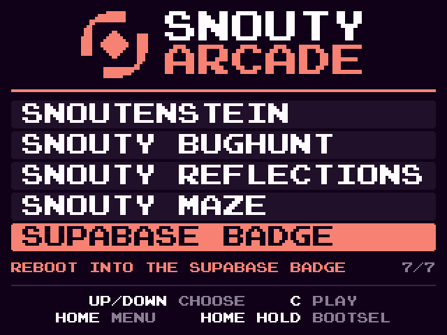

# Dual boot: Snouty Arcade beside the Supabase badge firmware

**Status:** verified on a real Supabase Select badge on 2026-10-02: the
launcher app starts the arcade, and SUPABASE BADGE returns to MicroPython.
Install steps for users are in [DEPLOY.md](DEPLOY.md) section 3A.

`zig-out/firmware/snouty-tufty-arcade-supabase.uf2` puts the Snouty Arcade
on the badge *next to* Supabase's MicroPython firmware instead of replacing
it. MicroPython stays the firmware the badge boots. A Badgeware app,
**Snouty Arcade** (`supabase-app/snouty_arcade/`), reboots into the arcade.
The arcade's last menu row, **SUPABASE BADGE**, reboots back.



The dual-boot build holds RAM carts only (no XIP carts). The normal arcade
(`snouty-tufty-arcade.uf2`, [ARCADE.md](ARCADE.md)) is unchanged. It still
replaces MicroPython.

## Flash map

The badge, from `picotool info -a` (MicroPython bw-1.29.0, `pimoroni_tufty2350`,
SDK 2.3.0, RP2350 A4, no partition table):

| Range | What | Dual-boot UF2 |
|---|---|---|
| 0x10000000..0x1014E220 | MicroPython binary (its last sector ends 0x1014F000) | never written |
| **0x1014F000..0x10150000** | **launcher sector**: 64-byte header + the 384-byte launch stub (`src/dualboot/stub.S`) | written |
| **0x10150000..0x10200000** | **arcade window** (704 KB): the Tufty OS + carts, linked at 0x10000000 | written (584 KB used) |
| 0x10200000..0x10300000 | ROMFS | never written |
| 0x10300000..0x11000000 | FAT drive (the badge's USB disk; LittleFS in its last 1 MB) | never written |

The build enforces this (`tools/dualboot_uf2.zig`, run by `zig build`):
every UF2 block must be RP2350_ARM_S main flash inside
0x1014F000..0x10200000, and the image must fit the window. Otherwise the
build fails and names the address. A UF2 load erases 4 KB sectors, one per
sector it writes (bootrom `nsboot/usb_virtual_disk.c`, "always erase a
single sector"). The gap starts and ends on sector boundaries, so no erase
reaches MicroPython's last sector or the ROMFS. The report goes to
`zig-out/firmware/snouty-tufty-arcade-supabase.flash.txt`:

```
snouty-tufty-arcade-supabase.uf2  (dual boot beside the badge's Supabase MicroPython, docs/DUALBOOT.md)
  2340 blocks, family 0xe48bff59 (RP2350_ARM_S), all main flash
  writes  0x1014F000..0x101E2200 only, inside the gap 0x1014F000..0x10200000
  untouched: 0x10000000..0x1014F000 (MicroPython bw-1.29.0 ends 0x1014E220) and 0x10200000.. (ROMFS, FAT drive)
  launcher 0x1014F000: header v1 + launch stub 384 bytes
  window   0x10150000..0x10200000 (704 KB), mapped to 0x10000000 by the bootrom (QMI ATRANS0)
  image    0x10150000..0x101E2110 = runtime 0x10000000..0x10092110, 598288 bytes (584.3 KB): 83.0% of the window, 122608 bytes (119.7 KB) free
  entry    vector table at runtime 0x10000000: SP 0x20020000, reset 0x10000129; IMAGE_DEF (EXE, Secure, Arm, RP2350) at +0x110
  cart images (byte-identical in the UF2 payload), in menu order:
    snouty-run           0x101529F0..0x10178014 (runtime 0x100029F0)  153124 bytes (149.5 KB)
    demosnout            ...
```

**Carts.** All six RAM carts of the normal arcade fit, in menu order:
snouty-run, demosnout, snoutenstein, snouty-bugs (SNOUTY BUGHUNT),
snouty-reflections, snouty-maze. Together they use 584 KB of the 704 KB
window, so none had to be dropped. `-Ddualboot_carts=a,b,c` picks a
different list and order, by the names of the `carts` table in build.zig.
If the carts do not fit, the build stops with the overflow and the biggest
cart:

```
error: dual boot: snouty-tufty-arcade-supabase.uf2: the arcade image is N bytes (... KB), over the 704 KB window
  0x10150000..0x10200000 by M bytes. The carts take ... bytes; the biggest is ...
```

## How it works

### Normal boot never sees the arcade

The bootrom's flash boot searches only the first 4 KB of flash for a block
loop. It also searches slot 1 (the next 4 KB) when slot 0 has no
short-circuit (datasheet 5.2.7; bootrom `varm_flash_boot.c`
`s_varm_crit_ram_trash_pick_boot_slot`). With no partition table it boots
MicroPython's IMAGE_DEF at 0x10000000. The arcade's IMAGE_DEF is at
0x10150110 and is never searched. Dropping the dual-boot UF2 reboots with
the FLASH_UPDATE type and p0 = 0x10000000 (the no-partition-table "absolute"
target). That only gives slot 0 preference, which is MicroPython, and
MicroPython is not TBYB-flagged. So after the flash, the badge boots
MicroPython as before.

The arcade carries an IMAGE_DEF because `chain_image()` (below) needs one.
It is microzig's: EXE, Secure, Arm, RP2350, no TBYB, a single block that
links to itself.

### Into the arcade: app, RAM_IMAGE reboot, stub, chain_image

**1. The app** (`supabase-app/snouty_arcade/`, logic in `snouty_dualboot.py`).
It runs in MicroPython, which is Arm Secure, privileged (`picotool`: "ARM
Secure image"). WATCHDOG, PSM, TICKS and SYSCFG default to Secure-privileged
access (datasheet 10.6.2.1), so `machine.mem32` can write them. The app then:

1. checks the launcher sector at 0x1014F000 (magic "SNOUTYDB" plus its
   complement, version, layout, the stub's CRC-32). If the sector is
   missing or damaged, it says so and the badge goes back to its launcher.
2. copies the stub into SRAM at a 256-byte aligned address. The address is
   inside the display framebuffer (`uctypes.addressof(display)`, the
   st7789 module's 300 KB buffer in main SRAM). The MicroPython heap is in
   PSRAM, and PSRAM does not survive a reset (`MICROPY_GC_SPLIT_HEAP 0`,
   "Don't use SRAM for MicroPython heap"). The app adds that address to
   vector words 1..3 and reads the stub back.
3. disables IRQs and writes the bootrom's watchdog boot vector for the
   one-shot RAM_IMAGE boot type. It uses the same registers, values and
   order as the bootrom's own `reboot()` (`varm_apis.c` `s_varm_hx_reboot`,
   lines 44..226):

   | Register | Value |
   |---|---|
   | WATCHDOG CTRL (0x400D8000) | 0 (disable, clear PAUSE) |
   | PSM WDSEL (0x40018008) | 0x01FFFFFE: everything but PROC_COLD (bootrom: `~PSM_WDSEL_PROC_COLD_BITS`) |
   | SCRATCH2 / SCRATCH3 | stub address / stub size (p0, p1: the RAM window) |
   | SCRATCH4 | 0 |
   | SCRATCH6 | 3 = BOOT_TYPE_RAM_IMAGE (the "sp" of a magic-pc vector) |
   | SCRATCH7 | 0xB007C0D3 (magic "pc": a special boot type) |
   | SCRATCH4 | 0xB007C0D3 |
   | SCRATCH5 | 0xFFFFFFFE = SCRATCH7 ^ -SCRATCH4 |
   | WATCHDOG LOAD | 10000 (10 ms) |
   | TICKS WATCHDOG | started (CYCLES 12, ENABLE) if it is not running |
   | SYSCFG AUXCTRL bit 0 (set alias 0x4000A014) | 1: POWMAN off clk_ref before the reset |
   | WATCHDOG CTRL | ENABLE |

   This is the reboot the bootrom itself uses after a RAM UF2 download.
   `nsboot` writes the image into SRAM and calls `reboot(RAM_IMAGE, ...)`
   with this WDSEL (`usb_virtual_disk.c` `write_uf2_page_complete`). So
   SRAM contents demonstrably survive it. A PSM-sequence watchdog reset
   keeps the watchdog scratch registers. Only a chip-level watchdog reset
   (POWMAN_WATCHDOG) or the RUN pin clears them (datasheet 12.9.5), and
   neither MicroPython nor Badgeware sets POWMAN_WATCHDOG.

The RP2040 protocol is different. There, SCRATCH4..7 carry a PC/SP for a
direct jump, and the SDK's `watchdog_reboot(pc, sp, ms)` still writes that
form. The RP2350 bootrom adds the magic-pc boot types (datasheet 5.2.4.1).

**2. The bootrom after the reset** (datasheet 5.2.2, Table 462; bootrom
`varm_boot_path.c`). Step 8 finds a valid vector: `pc_mod ^ -magic == pc`
and magic matches (line 1087). For the magic pc it checks
`pc_mod == -2` (line 1179). It clears SCRATCH4, so the request is one-shot,
then marks a RAM-image boot. Step 10 powers up all SRAM, and step 11 resets
the pads and IO and de-isolates the QSPI pads (lines 676..715). The
RAM-image boot then skips Check BOOTSEL, OTP boot and flash boot (line 865,
`s_varm_crit_ram_trash_checked_ram_or_flash_window_launch`). It searches
the window for the stub's IMAGE_DEF (at +0x10). It sets MSP and VTOR from
the stub's vector table and enters the stub in Secure thread mode. It goes
through the same thunk as a flash boot (`arm8_bootrom_rt0.S` lines 672..775),
which wipes boot RAM. If the stub were missing, the bootrom would drop to
BOOTSEL.

**3. The stub** (`src/dualboot/stub.S`, 384 bytes, position independent).
The chip is freshly reset: clk_sys is on the ROSC and the QMI is at its
reset state. IO_QSPI FUNCSEL is NULL (0x1f) after step 11, so XIP is not
connected to the pads. The flash itself was not reset, and MicroPython left
it in continuous-read mode (`PICO_EMBED_XIP_SETUP=1`). The stub does what
`s_varm_crit_ram_trash_try_flash_boot` does before it scans
(`varm_flash_boot.c` lines 38..49), through the public ROM API (datasheet
5.4.1 Table 464, 5.4.8):

1. `flash_reset_address_trans` ('RA'), `connect_internal_flash` ('IF'),
   `flash_exit_xip` ('EX'). The last one sends the XIP exit sequence.
2. `flash_select_xip_read_mode` ('XM') over the bootrom's 16
   mode/divisor pairs in its order: EBh, BBh, 0Bh, 03h at clkdiv 3, then 6,
   12, 24 (datasheet 5.2.7 Table 463; `varm_flash_boot.c` lines 89..206).
   It stops at the first pair under which the launcher magic reads back
   through the uncached, untranslated alias 0x1C14F000. The bootrom's own
   scan would pick the same pair, which is the one the arcade runs with
   after a normal flash boot.
3. `flash_flush_cache` ('FC'). After reset the XIP cache state is undefined
   (datasheet 4.4.1.2), and ATRANS is about to change (12.14.4.2).
   `chain_image` flushes again during verification (`varm_blocks.c` line 882).
4. `chain_image` ('CI') with work area 0x20080000 (SCRATCH_X, 4 KB; the
   SDK asks for 3264 bytes), window 0x10150000, size 0xB0000. The stack is
   at 0x20082000 (SCRATCH_Y top), outside the framebuffer the stub runs from.

**4. `chain_image()`** (datasheet 5.4.8.2; `varm_apis.c` line 529,
`varm_launch_image.c`). It searches the flash window for a block loop, and
the arcade's IMAGE_DEF is at +0x110. For a flash window it "rolls" the
window to the runtime address: roll = flash offset 0x150000 + ROLLING_WINDOW_DELTA
0, so `ATRANS0 = (0xB0 << 16) | 0x150` (lines 224..250) and ATRANS1..3
have size 0 (datasheet 5.1.19, 12.14.4). It verifies the image and finds
no TBYB flag, no rollback version and no load map. Then it reads SP and PC
from the vector table at runtime 0x10000000 (line 352) and enters through
the same thunk: boot RAM wiped, MSPLIM 0, MSP = 0x20020000,
VTOR = 0x10000000, PC = `_start` 0x10000129. It writes no flash and no
OTP: the downgrade-erase address is cleared because this is not a flash
update boot (lines 207..214), and TBYB and OTP rollback apply only to
flagged images and secure chips. If it returns, it failed.

**5. The arcade.** microzig's normal `_start` runs: zero .bss, copy
.data, FPU and fault enables. Then comes the normal init:
`clocks.init` sets VREG 1.20 V, then PLL_SYS 250 MHz, as in `src/clocks.zig`.
Then the Tufty OS. The state differs from a normal flash boot in these
ways, none of which the OS depends on:

| | After a normal flash boot | Here |
|---|---|---|
| Flash address map | identity | ATRANS0: runtime 0x10000000.. = physical 0x10150000.. (704 KB, nothing else mapped) |
| QMI read mode | found by the bootrom's scan | found by the same scan in the stub |
| Clocks, resets, pads | bootrom image-boot state | the same (same boot path up to step 11) |
| VTOR / MSP / MSPLIM | 0x10000000 / vector[0] / 0 | the same |
| PRIMASK | as the bootrom leaves it | the same: the stub does not touch it |
| Core 1 | in the bootrom, waiting for a launch | the same |
| Boot RAM XIP setup function | restores the found mode | written with unset arguments: the arcade never programs flash, so it never calls it |
| `rom_get_last_boot_type` | NORMAL | RAM_IMAGE, chained |
| SRAM | MicroPython leftovers | the same, plus the stub in the old framebuffer. .bss and cart RAM are zeroed before use |

### Back to Supabase

The **SUPABASE BADGE** row (A or C) calls the bootrom's `reboot()` with
REBOOT_TYPE_NORMAL (`src/system.zig` `reboot_normal`). That is a watchdog
reset of everything but the processor cold domain, and the QMI's address
translation is reset too. The bootrom then boots MicroPython as on any
reset. The RESET button does the same. HOME held 1 s still reboots into
BOOTSEL, as in the normal arcade.

### When a launch fails

Any failure in the stub, or any fault, reboots into MicroPython through
the watchdog. The stub leaves `SCRATCH0 = 0x534E0000 | code` and
`SCRATCH1 = detail`. The next time Snouty Arcade is opened, it shows the
code and clears it:

| What you see | Meaning |
|---|---|
| "LAST START FAILED: a bootrom function is missing (XX)" | code 1: a ROM table lookup returned 0 |
| "... no flash read mode reads the launcher sector" | code 2: none of the 16 QMI modes read back the magic |
| "... the bootrom refused the arcade image (chain_image) (ERR)" | code 3: `chain_image()` returned ERR (`BOOTROM_ERROR_*`) |
| "... the launch stub crashed (pc 0x...)" | code 4: NMI or HardFault in the stub |
| The badge shows up as the **RP2350** drive | the bootrom did not accept the stub as a RAM image. Press RESET |
| Black screen, no reaction | the arcade crashed after launch. Press RESET |

The app also stops before rebooting if the arcade is not installed or the
stub in flash fails its CRC.

## Install

From a Mac with picotool (see [DEPLOY.md](DEPLOY.md); keep the backups from
its step 0).

1. **Check the firmware end.** In BOOTSEL (hold BOOT/HOME, tap RESET,
   release), run `picotool info -a`. The binary must end at or below
   **0x1014F000** (bw-1.29.0: `0x10000000-0x1014e220`). If it ends higher,
   for example because MicroPython was updated, stop: this UF2 would
   overwrite part of it.
2. **Flash the arcade.** Still in BOOTSEL, drag
   `snouty-tufty-arcade-supabase.uf2` onto the `RP2350` drive. Or run:
   ```sh
   picotool load snouty-tufty-arcade-supabase.uf2
   picotool reboot
   ```
   The badge reboots into the Supabase firmware as usual. Never load
   `zig-out/supabase-debug/*.runtime.elf`: it carries the 0x10000000
   runtime addresses and would overwrite MicroPython. Do not pass
   `-o`/offsets to picotool: the UF2 already has the right addresses.
3. **Copy the app.** Double-tap RESET. The badge's USB disk (TUFTY /
   Tufty2350) mounts. Copy the folder `supabase-app/snouty_arcade/` into its
   `apps/` folder, so you get `apps/snouty_arcade/__init__.py`,
   `snouty_dualboot.py` and `icon.png`. Eject, then press RESET.
4. **Start it.** In the badge launcher, select **Snouty Arcade** and press B.
   The Snouty Arcade menu comes up about a second later.

Optional checks after step 2: `picotool info -a` still shows MicroPython.
`picotool save -r 0x1014F000 0x10150000 launcher.bin` starts with `SNOUTYDB`.

**Updating** the arcade: repeat step 2. The app reads the stub from flash,
so it only needs copying again if `snouty_dualboot.py` changes. A header
version mismatch says so.

**Removing** it: delete `apps/snouty_arcade` from the drive. The 704 KB in
the gap is unused by MicroPython and can stay as it is. To restore the
exact original flash, use `full-flash.bin` (DEPLOY.md step 3).

## Recovery

Nothing in this design writes outside 0x1014F000..0x10200000. Nothing
writes OTP, the POWMAN boot vector, BOOT_FLAGS or a partition table. The
only boot request is one-shot (the bootrom clears SCRATCH4 when it acts on
it). So:

* **RESET** always boots MicroPython. The watchdog vector is consumed and
  the RUN pin clears the scratch registers anyway.
* **BOOT (HOME) + RESET** always reaches BOOTSEL. On a RUN-pin reset there
  is no vector, so the bootrom reaches Check BOOTSEL and sees QSPI CSn low.
  Nothing here changes that path.
* A bad UF2 in the gap can at worst stop the arcade from launching.
  MicroPython never runs code from the gap.
* Full restore: `firmware-2mb.uf2` or `full-flash.bin` from DEPLOY.md.

## Hardware-risk checklist

Tested on the host only. These are the assumptions a real badge has to
confirm:

- [ ] The UF2 writes only 0x1014F000..0x101E2200 (the report says so;
      `picotool info -a` after the flash still shows MicroPython intact).
- [ ] MicroPython still boots after the flash, and the drag-and-drop's
      FLASH_UPDATE reboot lands in MicroPython.
- [ ] `uctypes.addressof(display)` is in main SRAM on the Supabase build.
      The app refuses otherwise, with "No SRAM buffer". The Supabase build
      may differ from pimoroni/tufty2350 here.
- [ ] OTP BOOT_FLAGS0.DISABLE_SRAM_WINDOW_BOOT and
      DISABLE_WATCHDOG_SCRATCH are clear. If either is set, the badge boots
      MicroPython again and nothing happens. `picotool otp get BOOT_FLAGS0`
      shows them.
- [ ] OTP BOOT_FLAGS0.DISABLE_XIP_ACCESS_ON_SRAM_ENTRY is clear. If it is
      set, the stub faults (code 4) and the badge returns to MicroPython.
- [ ] The stub's mode search finds the same QMI mode as the normal boot.
      At 250 MHz the arcade runs with that mode, as the normal arcade does.
- [ ] `chain_image()` accepts the window: the badge is not secure-boot
      enabled (the image is unsigned).
- [ ] The arcade behaves as the normal arcade: menu, carts, HOME, HOME
      held 1 s = BOOTSEL, and SUPABASE BADGE returns to MicroPython.
- [ ] The stub runs with interrupts as the bootrom leaves them. Nothing in
      the NVIC is enabled after the reset.
- [ ] Repeat launches and returns ten times: SCRATCH0 stays clear and
      nothing accumulates.

## Host verification

```sh
zig build                 # all firmware, including the dual-boot UF2 + its .flash.txt
zig build supabase        # just the dual-boot UF2
zig build test            # unit tests: layout, header, packer, UF2 range check, the exit row
zig build supabase-test   # python3: the app logic on this UF2, and the stub emulated
                          # (needs `pip install unicorn`; skipped without it)
arm-none-eabi-objdump -d -M force-thumb --start-address=0x24 zig-out/supabase-debug/dualboot-stub.elf
arm-none-eabi-objdump -d --start-address=0x10000128 --stop-address=0x10000184 zig-out/supabase-debug/snouty-tufty-arcade-supabase.runtime.elf
```

What they check:

* `tools/dualboot_uf2.zig` re-reads the UF2 it wrote. Every block must be
  in the gap, the header and image must read back, the vector table must be
  SP in SRAM and a Thumb reset inside the image, an IMAGE_DEF must be the
  first block in the first 4 KB, and every cart must be byte-identical.
* `src/dualboot/layout.zig` tests that stub.S's constants match the layout.
* `src/arcade.zig` tests the exit row: it is last, the cursor wraps
  through it, A or C exits and never launches, HOME held still gives
  BOOTSEL, and a held HOME blocks it.
* `tools/test_supabase_app.py` runs the app's logic with a fake
  `machine.mem32` that reads back signed values, as MicroPython does. It
  checks the header and stub, the base alignment and SRAM bounds, the
  relocation, and the exact reboot register sequence (both tick states).
  With unicorn, it runs the stub as a Cortex-M33 with mocked ROM functions.
  It checks the call order, the 16-mode search order, the chain_image
  arguments, and the watchdog writes of every failure path.

## Sources

RP2350 datasheet (build 01/10/2026, version 80d627281ed5): 4.4.1.2 (XIP cache
state after reset), 5.1.5 (block loops, 4 KB search), 5.1.19 and 12.14.4
(address translation, rolling windows, cache flush), 5.2.2 Table 462 and
5.2.2.1 (boot sequence), 5.2.4 and 5.2.4.1 (watchdog boot vector, special
boot types, SCRATCH2/3 parameters), 5.2.5 (RAM image boot), 5.2.7 and Table
463 (flash boot, mode order), 5.4.1 Table 464 (ROM table lookup at 0x16),
5.4.8.2 chain_image, 5.4.8.3 connect_internal_flash, 5.4.8.7 flash_exit_xip,
5.4.8.8 flash_flush_cache, 5.4.8.12 flash_reset_address_trans, 5.4.8.14
flash_select_xip_read_mode, 5.4.8.24 reboot (types, p0/p1), 10.6.2.1
(default bus permissions), 12.9.5 (watchdog scratch persistence), IO_QSPI
GPIO_QSPI_SCLK_CTRL (FUNCSEL reset 0x1f).

RP2350 A4 bootrom source (github.com/raspberrypi/pico-bootrom-rp2350,
c6cdb17 "A4 bootrom"):
`src/main/arm/varm_apis.c` `s_varm_hx_reboot` (44..226) and
`s_varm_api_chain_image` (529..584);
`src/main/arm/varm_boot_path.c` steps 7..12 (551..760), RAM boot (864..873),
`sonly_varm_step_safe_crit_try_vector` (1080..1235);
`src/main/arm/varm_flash_boot.c` `s_varm_crit_ram_trash_try_flash_boot`
(38..49), the scan loop (61..213), `s_varm_crit_search_window` (441..);
`src/main/arm/varm_launch_image.c` roll and ATRANS (190..261), launch
(263..535), `s_varm_crit_ram_trash_checked_ram_or_flash_window_launch` (536..);
`src/main/arm/arm8_bootrom_rt0.S` the entry thunk (672..775);
`src/main/arm/varm_blocks.c` the cache flush on verify (870..885);
`src/nsboot/usb_virtual_disk.c` sector erase (316..325) and the post-UF2
reboot (241..273).

Pico SDK 2.2.0: `src/rp2_common/boot_bootrom_headers/include/boot/bootrom_constants.h`
(lookup offset 0x16, RT_FLAG_FUNC_ARM_SEC, ROM codes 155..206, XIP modes
280..284, error codes 38..58), `src/common/boot_picoboot_headers/include/boot/picoboot_constants.h`
(REBOOT2 flags 14..25), `src/rp2_common/pico_bootrom/include/pico/bootrom.h`
(`rom_func_lookup_inline` 193..215, `rom_chain_image` 860..894),
`src/rp2_common/hardware_watchdog/watchdog.c` (`watchdog_reboot` 92..114,
the RP2040-style form), `src/common/boot_picobin_headers/include/boot/picobin.h`
(block markers, IMAGE_TYPE bits), `src/rp2350/hardware_regs/include/hardware/regs/`
(`addressmap.h`, `watchdog.h`, `psm.h`, `ticks.h`, `syscfg.h`).

Badgeware / MicroPython: pimoroni/tufty2350 `board/mpconfigboard.h` (heap
in PSRAM), `board/filesystem.cmake` (flash map), `modules/c/st7789/`
(framebuffer in `.uninitialized_data`, buffer protocol),
`modules/common/badgeware/__init__.py` (`launch()`, `display` builtin),
`modules/common/_boot_fat.py` (`/system` = the USB drive), `firmware/apps/`
(app layout, 24x24 `icon.png`); pimoroni/micropython bw-1.29.0-gc
`ports/rp2/CMakeLists.txt` (`PICO_EMBED_XIP_SETUP=1`) and
`extmod/machine_mem.c` (signed `mem32` reads).
