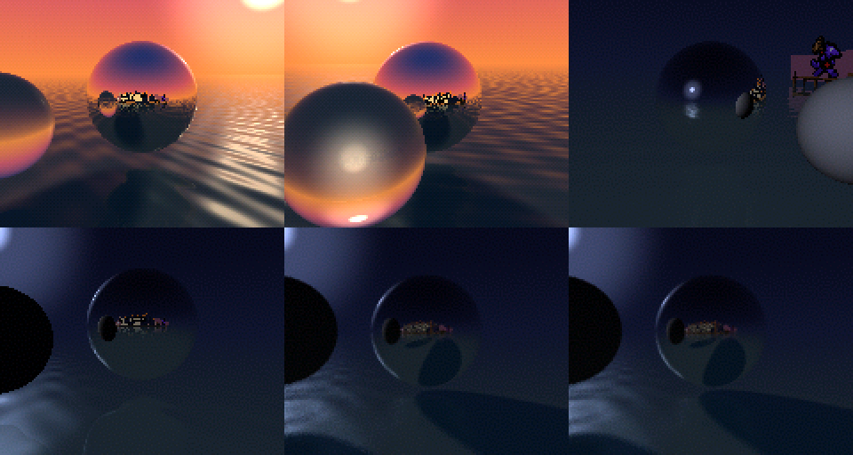

# snouty-reflections on the Tufty

> **2026-10-02, shipped variant: `full15`, carts unmodified.** Adrian's
> rule: Tufty-specific work lives in this repo, and the monorepo carts stay
> as they are. So the submodule is back at 48c0d18, and the Tufty build
> passes the stock `-Dreflections_variant=full15`. That is the same scene
> and the same render cost as `tufty20` below (65.72 ms worst at 150 MHz,
> about 39.4 ms at 250 MHz), at 15 fps against a 66.7 ms budget. The
> `tufty20` notes below record the 20 fps option. Its cart commit
> (cfe3046, branch `reflections/tufty20`) exists only in this repo's
> submodule clone and is not used.

Snouty on the Water is a real-time ray tracer: chrome spheres on a rippling
lake, four presets, and a freeze-frame path tracer (M4). The sources are in
`snouty-badge/carts/snouty-reflections`. The submodule is pinned at cfe3046,
branch `reflections/tufty20`, which is 48c0d18 plus the `tufty20` variant.
The map primitives are defined in [README.md](README.md).

## 1. Build and flash

```sh
zig build -Dcart=snouty-reflections
# -> zig-out/firmware/snouty-tufty-snouty-reflections.uf2   (Tufty OS + cart, 250 MHz)
#    zig-out/firmware/cart/snouty-reflections.{elf,bin}     (the embedded cart, for inspection)
```

* **Variant `tufty20`.** `build.zig`'s `carts` table passes
  `-Dreflections_variant=tufty20` to the submodule build. That is full15's
  scene at 20 fps (section 5). The Tufty image is therefore not the SYCL
  `dist/` build, whose default is cut20.
* **Scale `crop`.** This is the cart's default in the `carts` table
  (section 4). `-Dscale=fit|native` still overrides it. snouty-run keeps
  `fit`.
* Flash it as in [../DEPLOY.md](../DEPLOY.md). HOME short press restarts the
  cart, and HOME held 1 s reboots into BOOTSEL.

UF2 facts (checked here with `snouty-badge/tools/uf2_info.py`): 469 blocks,
family `0xe48bff59` (RP2350_ARM_S), targets `0x10000000..0x1001d500`
(120,064 bytes). That is far below the `0x10200000` limit, and it is one
contiguous range, so there is no `0x10ffff00` block. The cart image
(`cart.bin`) is 110,048 bytes: `.text` 109,616, `.data` 64, `.bss` 109,552
(zeroed at launch, it ends at 0x2006aad0). Its `.text` is byte-identical to
the monorepo's own `-Dreflections_variant=tufty20` build.

## 2. Controls

### What the cart reads

All input goes through `app.handle_input()`, once per update (20 a second).
Directions are levels. A, B, Select and Start are press edges
(`input.pressed`).

| Input | Attract (default) | Free camera | Frozen |
|---|---|---|---|
| Left/Right (held) | enter free camera, orbit | orbit | orbit the frozen view (restarts accumulation) |
| Up/Down (held) | enter free camera, height | height 1.0..1.8 m, 50 mm per update | height |
| A (edge) | freeze (the path tracer takes over) | freeze | unfreeze, time resumes |
| B (edge) | cycle dither: bayer_temporal, blue_noise, palette16, none | same | same (re-quantises the accumulator) |
| Select (edge) | next preset (sunset, midnight, noon, storm) | same | next preset, and restart the path tracer |
| Start (edge) | nothing | back to attract | unfreeze and go back to attract |

Timeouts: the free camera returns to attract after 20 s without input. A
converged frozen image returns after 60 s. Click is never read. There is no
HUD and no audio.

### Final map (`controls_map.snouty_reflections`)

| Tufty | Cart sees | Effect |
|---|---|---|
| A (held) | left | orbit left |
| B (held) | right | orbit right |
| UP (held) | up | camera up |
| DOWN (held) | down | camera down |
| **C** | a | **freeze / unfreeze**, on the press, never delayed |
| A+B | select | next preset |
| UP+DOWN | b | next dither |
| HOME, short press | (OS) | restart the cart, which is also "back to attract" |
| HOME, held 1 s | (OS) | reboot into BOOTSEL |

* **`chord_ms = 60`.** A, B, UP and DOWN are chord members, so their
  direction bits start 60 ms after the press. Without the delay, the first
  frame of A+B would leave attract for the free camera every time someone
  changes the preset. At 20 fps that is about one update of extra latency.
  A member tapped and released inside the 60 ms still reaches the cart as a
  2-present pulse. After a chord, a member that is still held stays masked
  until it is released.
* **C is not in any chord**, so freeze is immediate. That is the headline
  feature, on one button that the right thumb can press while steering.
* **Start is not mapped.** The port notes proposed "C hold 600 ms =
  start". That would need C as tap = a, which moves freeze to the release
  and turns a long press into "back to attract", the opposite of what a
  person holding C expects. A HOME tap restarts the cart into attract, and
  the cart's timeouts get there anyway.
* Host tests: `src/controls_map.zig`, the `reflections:` tests. A `Cart20`
  harness runs the mapper every 1 ms and samples Controls once per 50 ms
  update with the cart's own edge detection. They cover:
  * C freezes on the first update, and a 10 ms tap between updates still
    freezes once.
  * A held orbits and never sends select.
  * A+B pressed 30 ms apart gives exactly one preset change and no
    left/right. UP+DOWN gives exactly one dither step and no height change.
  * A chord formed after a long A hold stops the orbit at once.
  * C works while A+UP steer.
  * Start and click are never sent.

## 3. What you should see

* Sunset first. Two chrome spheres and the glass sphere move on a rippling
  lake, the skyline and the Iris logo are on the shore, and the camera
  orbits once every 30 s. Each orbit ends with a 0.5 s fade into the next
  preset: midnight, noon, storm.
* All of this is at 20 fps, including the glass sphere and the spheres'
  shadows on the water. The SYCL badge ships cut20, which drops both. Bayer
  temporal dither is the default.
* Press A/B or UP/DOWN and the camera is yours (free camera). After 20 s
  without input it goes back to the tour.
* Press C and the picture stops, then refines: the path tracer adds passes
  every update, and the noise fades over about half a minute. Press C again
  to resume.

Frames 0, 100, 200 (top) and 300, 400, 500 (bottom) of the controls bench
in section 6, at the Tufty's 2x: sunset; free camera with orbit and height;
midnight after A+B; midnight in blue-noise dither after UP+DOWN, camera
moving; frozen; frozen and refined.



## 4. Scale mode: crop

* There is no HUD. The names and the Iris logo are traced into the scene
  (the shore texture), away from the edges. The `-Ddebug_overlay` text at
  y 0/8/16 is off by default.
* Crop is an exact 2x2 with square pixels, so the Bayer, blue-noise and
  palette16 dithers stay regular and the spheres stay round. In fit, 1 row
  in 8 is single height. That breaks the 4x4 dither cells into visible
  horizontal bands, the temporal dither shimmers unevenly, and the spheres
  come out 6.7% wider than tall.
* Crop loses 4 rows of sky and 4 rows of near water. Nothing is composed
  there.

## 5. The variant: `tufty20`

The Tufty runs the same RP2350 core at 250 MHz, not 150. full20 is still too
slow: 90.48 ms worst at 150 MHz is about 54 ms at 250, against a 47 ms
budget. full15's knobs do fit at 20 fps. So the monorepo now has
`tufty20 = config_of(.full15)` with `fps = 20`, a few lines in
`cart/src/variant.zig` plus the name in its tool tables. Its
`docs/variants.md` has the full section.

**The gate.** 94% of the 50 ms period is 47.0 ms at 250 MHz.
badge-bench models a 150 MHz core, so the gate in modelled time is
47.0 x 250 / 150 = **78.3 ms at 150 MHz**. Cycles carry over 1:1 because this
is a RAM cart: code and data are in SRAM at the system clock, so no flash or
XIP stalls apply.

## 6. Perf (calibrated badge-bench busy ms)

All four presets, measured 2026-10-02 on the tufty20 ELF. The 250 MHz
column is the 150 MHz figure x 0.6.

| Run | Preset | Worst @150 (frame) | Mean @150 | Worst @250 est. | Mean @250 est. | vs gate (78.3 @150 = 47.0 @250) |
|---|---|---|---|---|---|---|
| attract, 4 orbits (M3 row 2) | sunset | **63.44** (324) | 59.17 | **38.1** | 35.5 | PASS |
| | midnight | 51.95 (847) | 47.52 | 31.2 | 28.5 | PASS |
| | noon | 52.02 (1447) | 46.72 | 31.2 | 28.0 | PASS |
| | storm | 48.30 (2058) | 45.07 | 29.0 | 27.0 | PASS |
| height sweep, a table rebuild every frame (M3 row 3) | sunset | **65.72** (356) | 59.54 | **39.4** | 35.7 | PASS, 16% spare |
| | midnight | 54.25 (836) | 48.08 | 32.6 | 28.8 | PASS |
| | noon | 54.58 (1444) | 47.23 | 32.7 | 28.3 | PASS |
| | storm | 50.51 (2052) | 45.09 | 30.3 | 27.1 | PASS |
| controls bench, 600 updates (Tufty cart ELF) | sunset, midnight | 62.72 (74) | 48.04 | 37.6 | 28.8 | PASS |

* Sunset is the heaviest preset, because it is the only one with the glass
  sphere. The worst frame anywhere is 65.72 ms modelled, about 39.4 ms on
  the Tufty. That leaves 7.6 ms (16%) of the 47 ms budget, so no knob was
  cut.
* The controls bench drives the cart with the Controls this map produces:
  * LEFT+UP 60..140: orbit and height
  * SELECT at 160: A+B
  * B at 200: UP+DOWN
  * RIGHT+DOWN 240..300
  * A at 320: freeze. A at 520: unfreeze.

  Command:
  `snouty-badge/badge-bench/bench.sh zig-out/firmware/cart/snouty-reflections.elf --script <that script> --frames 600 --budget-ms 78.3`.
* Frozen updates take about 42 ms @150, of which the slice is a 36 ms
  wall-clock deadline (`pt.slice_us`). On the Tufty the slice stays 36 ms,
  and the rest drops to about 4 ms. So a frozen update is about 40 ms out of
  50, and the tracer gets 1.67x as many passes per update. 256 passes should
  take about 35 s instead of the SYCL badge's 58 s.
* Monorepo commands: `M3_VARIANT=tufty20 M3_BUDGET=78.3
  tools/bench_variants.sh --m3 2 3`, run from
  `snouty-badge/carts/snouty-reflections`.

For comparison, the other variants (from the 2026-10-02 notes, sunset
only):

| Variant | Worst @150 | Tufty est. worst | Tufty budget | Verdict |
|---|---|---|---|---|
| cut20 | 49.73 | 29.8 | 47.0 | ok, but no glass and no water shadows |
| full20 | 90.48 | 54.3 | 47.0 | over |
| full15 | 64.83 | 38.9 | 62.7 | ok, at 15 fps |
| **tufty20** | **65.72** (all presets) | **39.4** | 47.0 | **ok, at 20 fps** |

## 7. Risks and unknowns

* **SRAM contention is not modelled.** Core 0 reads the cart's other
  framebuffer column by column for the 2x scaler while core 1 traces.
  badge-bench does not model that bank contention. The 16% spare covers
  the 10% reserve the notes asked for. If the badge shows stutter in
  sunset, ship `-Dreflections_variant=cut20` (29.8 ms) or full15 at
  15 fps, a one-word change in `build.zig`'s `carts` table.
* **TIMER0 at 1 MHz is required.** `pt.step` traces until
  `micros_since_boot` passes its deadline. A wrong tick rate either overruns
  the frame or starves the tracer. The OS leaves TIMER0 on clk_ref, as on
  the SYCL badge. Check it on hardware: frozen mode should stay smooth at
  20 fps, and the image should visibly refine within a few seconds.
* **The 0.6 scaling assumes the M33 at 250 MHz runs SRAM code at the same
  CPI as at 150.** It does for SRAM (single-cycle at the system clock), and
  this cart never touches flash. An XIP build would scale worse. Stay on
  RAM.
* **The variant is compile-time.** The Tufty image differs from the SYCL
  `dist/` build. Keep `reflections_variant = "tufty20"` in `build.zig`.
* **The submodule commit is local.** cfe3046 (branch `reflections/tufty20`)
  is not on GitHub yet. It has to reach the monorepo and GitHub before
  anyone else can check out this pin.
* **Not tested on hardware:** the map's feel (60 ms chord delay, A/B
  rocking), crop on the real panel, and the frame rate.
